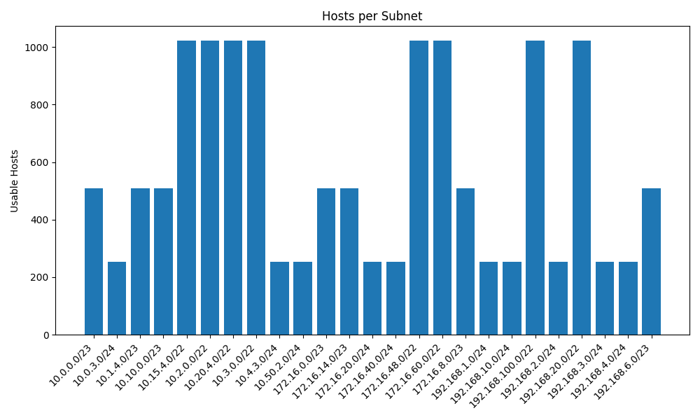
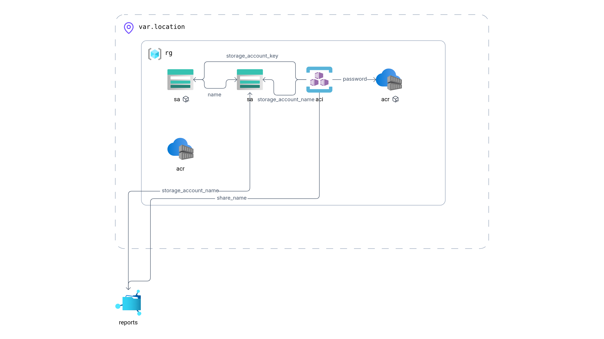

# Subnet Analysis & Visualization Tool

A Python-based utility to analyze IP address data, generate subnet reports, and visualize usable host counts per subnet. It also includes Terraform configurations to deploy resources on Azure and a GitHub Actions CI pipeline for automated testing and deployment.

## Table of Contents

* [Features](#features)
* [Prerequisites](#prerequisites)
* [Getting Started (Local)](#getting-started-local)

  * [Clone the Repository](#clone-the-repository)
  * [Install Dependencies](#install-dependencies)
  * [Run Subnet Analysis](#run-subnet-analysis)
  * [Generate Visualization](#generate-visualization)
  * [View Report](#view-report)
  * [Run Tests](#run-tests)
* [Docker Usage](#docker-usage)

  * [Build Docker Image](#build-docker-image)
  * [Run in Container](#run-in-container)
* [CI Pipeline](#ci-pipeline)
* [Terraform Deployment on Azure](#terraform-deployment-on-azure)
* [File Structure](#file-structure)
* [License](#license)

## Features

* **Analyze** IP & subnet data from an Excel file (`ip_data.xlsx`) and output a CSV or JSON summary (`subnet_report.csv` or `subnet_report.json`).
* **Auto-generate** a Markdown report (`report.md`) answering key analysis questions:

  1. Subnet with the most hosts
  2. Overlapping subnets
  3. Smallest & largest subnets
  4. Suggested subnetting strategy
* **Visualize** usable host counts per subnet as a bar chart (`network_plot.png`).
* **Unit tests** for core functionality with pytest.
* **CI pipeline** with GitHub Actions to run tests and Terraform plan/apply.
* **Terraform modules** to deploy Azure resources (resource group, storage account, container, etc.) for state backend and future expansions.

## Prerequisites

* Python 3.8 or newer
* pip
* Docker (optional, for containerized execution)
* Terraform 1.0+
* Azure CLI
* A Service Principal or Azure user with appropriate permissions

## Getting Started (Local)

### Clone the Repository

```bash
git clone https://github.com/KareemMoataz02/Subnet-Analysis-and-Visualization-Tool.git
cd Subnet-Analysis-and-Visualization-Tool
```

### Install Dependencies

```bash
pip install --upgrade pip
pip install -r requirements.txt
```

### Run Subnet Analysis

By default, reads `ip_data.xlsx` and writes `subnet_report.csv` and `report.md`:

```bash
python subnet_analyzer.py --input ip_data.xlsx --output subnet_report.csv
```

Additional options:

* `--json` to emit JSON instead of CSV
* `--skip-summary` to skip creating the CSV/JSON
* `--skip-report` to skip generating `report.md`

> **Windows users**: use double quotes (`"`) or escape backslashes in paths.

### Generate Visualization

```bash
python visualize.py --input subnet_report.csv --output network_plot.png
```

### View Report

Open `report.md` in your preferred Markdown viewer or text editor.

### Run Tests

```bash
pytest --maxfail=1 --disable-warnings -q
```

## Docker Usage

A Dockerfile is included for an isolated environment.

### Build Docker Image

The image **name** and **tag** (`subnet-analysis-tool`) is set by the `-t` flag in the build command—not in the Dockerfile itself.

```bash
docker build -t subnet-analysis-tool .
```

### Run in Container

Mount your project directory and run analysis + visualization:

```bash
docker run --rm -v "$(pwd):/app" subnet-analysis-tool \
  bash -c "python subnet_analyzer.py --input ip_data.xlsx --output subnet_report.csv && \
            python visualize.py --input subnet_report.csv --output network_plot.png"
```

All output files (`subnet_report.csv`, `report.md`, `network_plot.png`) will appear in your host directory.

## CI Pipeline

A GitHub Actions workflow is defined in `.github/workflows/ci.yml`. It performs:

1. **Checkout** source code
2. **Set up** Python and install dependencies
3. **Run** pytest unit tests
4. **Install** Terraform and initialize the Azure backend
5. **Run** `terraform plan` (and optionally `terraform apply` on `main` branch)

Trigger: on every `push` to any branch. Customize in `ci.yml` as needed.

## Terraform Deployment on Azure

Terraform configurations in the `terraform/` directory define resources for Azure state management and other infrastructure:

1. **Configure backend** in `backend.tf` pointing to a storage account and container
2. **Define** resource group, storage account, container, and access policies across files:

   * `resource_group_acr.tf` (resource group)
   * `storage.tf` (storage account)
   * `container_group.tf` (blob container for state)
   * `providers.tf`, `variables.tf`, `outputs.tf`

### Steps to Provision

```bash
# Log in to Azure
az login --service-principal -u <APP_ID> -p <PASSWORD> --tenant <TENANT_ID>

# Initialize Terraform (uses backend.tf settings)
cd terraform
terraform init

# Preview changes
terraform plan -var="resource_group_name=<RG_NAME>" \
  -var="storage_account_name=<STORAGE_NAME>" \
  -var="container_name=tfstate" -var="key=subnet-analyzer/terraform.tfstate"

# Apply changes
terraform apply -auto-approve -var="..."
```

After provisioning, the state file in the Azure Blob container will be used by subsequent runs.

## Visuals

### Network Visualization


*Bar chart showing usable hosts per subnet.*

### Cloud Architecture


*Diagram of the Azure resources and Terraform-managed state backend.*

## File Structure

```
├── .github/workflows/ci.yml       # CI pipeline definitions
├── Dockerfile                     # Docker build instructions
├── ip_data.xlsx                   # Sample input Excel file
├── requirements.txt               # Python dependencies
├── subnet_analyzer.py             # Main analysis script
├── visualize.py                   # Visualization script
├── subnet_report.csv              # Generated CSV summary
├── report.md                      # Generated Markdown report
├── network_plot.png               # Generated chart
├── terraform
│   ├── backend.tf                 # Terraform backend configuration
│   ├── providers.tf               # Provider definitions and variables
│   ├── resource_group_acr.tf      # Resource group
│   ├── storage.tf                 # Storage account
│   ├── container_group.tf         # State container
│   ├── outputs.tf                 # Outputs
│   └── variables.tf               # Input variables
├── tests
│   ├── test_subnet_analyzer.py    # Unit tests for analysis
│   └── test_visualize.py          # Unit tests for visualization
└── README.md                      # This file
```
